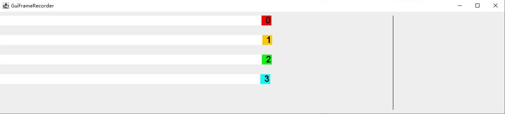
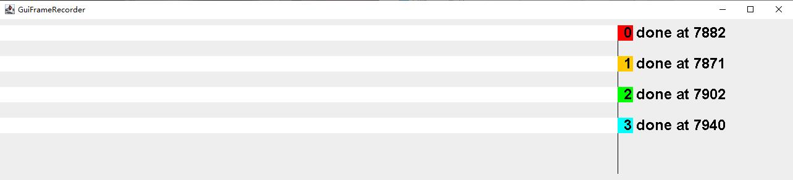

[](https://jitpack.io/#hundun000/umamusume-simulation)

## 开发中

游戏 《赛马娘 Pretty Derby》 比赛模拟。

公式和数值参考原作游戏的解包研究。以模拟的游戏帧进行一场比赛，即模拟赛马每一帧时的位移量，速度，加速度。

模拟结果的记录形式和输出形式可选择多种实现。

data类形式记录，GUI形式输出（UmamusumeAppTest.testGuiDisplayer()）：  
  
  

文字形式记录和输出（UmamusumeAppTest.testCharImageDisplayer()）：
```
[tick 0] 樱花赏 1600米
赛道1: 无声铃鹿A 逃  速800，耐400，力600，根600，智200
赛道2: 黄金船A 追  速800，耐400，力600，根600，智200
赛道3: 草上飞A 差  速800，耐400，力600，根600，智200
赛道4: 特别周A 先  速800，耐400，力600，根600，智200

[tick 59] 00:00.59 无声铃鹿A率先进入初期巡航阶段
[o          ] 6m
馬无声铃鹿A -----------> 
馬黄金船A  -> 
馬草上飞A  -> 
馬特别周A  -> 

[tick 1408] 00:14.08 无声铃鹿A率先进入中期巡航阶段
[=o         ] 257m
馬无声铃鹿A -----------> 
馬黄金船A  -> 
馬草上飞A  --> 
馬特别周A  ---------> 

[tick 3413] 00:34.13 无声铃鹿A率先进入中期巡航(过半)阶段
[====o      ] 661m
馬无声铃鹿A -----------> 
馬黄金船A  -> 
馬草上飞A  -> 
馬特别周A  ----> 

[tick 5405] 00:54.05 黄金船A率先进入末期巡航阶段
[======o    ] 1058m
馬无声铃鹿A -------> 
馬黄金船A  -----------> 
馬草上飞A  -------> 
馬特别周A  -> 

[tick 6832] 01:08.32 无声铃鹿A率先进入末期冲刺阶段
[tick 7281] 01:12.81 草上飞A进入末期冲刺阶段
[tick 7367] 01:13.67 特别周A进入末期冲刺阶段
[tick 7460] 01:14.60 黄金船A最晚进入末期冲刺阶段
[=========o ] 1492m
馬无声铃鹿A ---> 
馬黄金船A  -----------> 
馬草上飞A  --------> 
馬特别周A  -> 

[tick 7871] 01:18.71 黄金船A率先冲线
[=========o ] 1584m
馬无声铃鹿A ------> 
馬黄金船A  冲线时间：01:18.71
馬草上飞A  ---------> 
馬特别周A  -> 

[tick 7882] 01:18.82 草上飞A冲线
[tick 7902] 01:19.02 无声铃鹿A冲线
[tick 7940] 01:19.40 特别周A最晚冲线
[==========o] 1600m
馬无声铃鹿A 冲线时间：01:19.02
馬黄金船A  冲线时间：01:18.71
馬草上飞A  冲线时间：01:18.82
馬特别周A  冲线时间：01:19.40
```